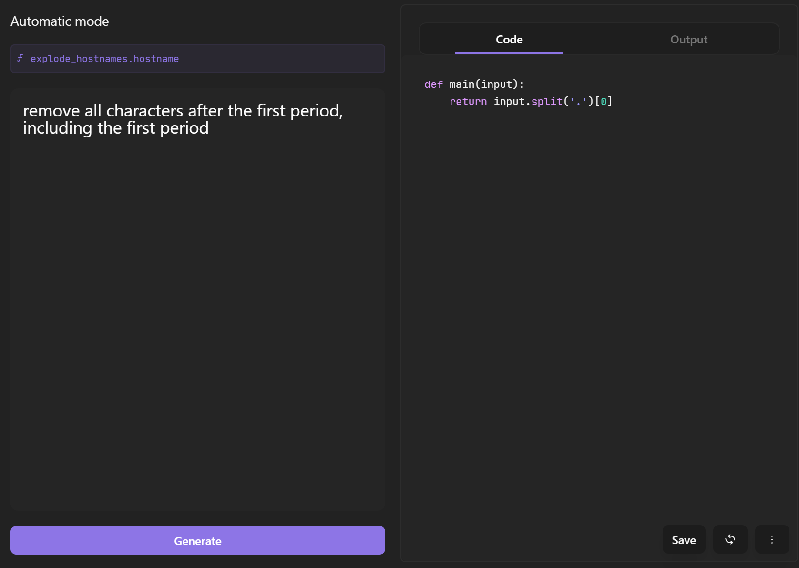

# Automating EDR Compliance with Tines
NIST updated the [Cybersecurity Framework (CSF)](https://www.nist.gov/cyberframework).  They introduced the Govern function as the glue to the other functions of risk management:
- Identify,
- Protect,
- Detect,
- Respond,
- and Recover.

Governance means creating a framework taliored to support the organization's critical mission. To ensure an organization can maintain operations in a cyber incident, infosec policies and standards are created to reduce cyber risk or business risk.  Compliance is the means to ensure adherence to the infosec standards and policies.

To assit with IT departments with EDR compliance, my teammate and I created a web form where an IT admin or infosec analyst can upload a csv with hostnames to check to see if the host is present in the CrowdStrike Falcon platform.

In addition, hosts are tagged with the departmental ID, so the hosts are incorporated into the CrowdStrike Fusion Workflows for vulnerability reporting and for alert notification on host detections by the Falcon sensor.

The webform provides the analyst the option to perform an audit or to tag CrowdStrike hosts.  The workflows are straightforward using the Tines Crowdstrike templates for the Get host IDs, Get Host details, and Tag Host in Crowdstrike, which are available in the Tines product templates.
### AI Automatic to Strip the FQDN of the hostname
The hostnames are parsed from the csv, and each hostname is exploded as an individual event.  Since the CrowdStrike API for host management has a quirk in regards to fully qualified domain names (FQDN), we used the Tines AI Automatic mode to strip the hostname of the FQDN.

If an analyst submits a host with a FQDN, and the host is registered without a FQDN, CrowdStrike Host API will not find the host.  The API will return a FQDN if searching just by the host name.

For example, host1.mydomain.com is registered in the console.  The Falcon API will return it if the hostname submitted is host1 or host1.mydomain.com, but if host1.mydomain.com is submitted and host1 is registered, the Falcon Host API will not find it.

### CrowdStrike Tagging Trigger Logic

In the webform, 

