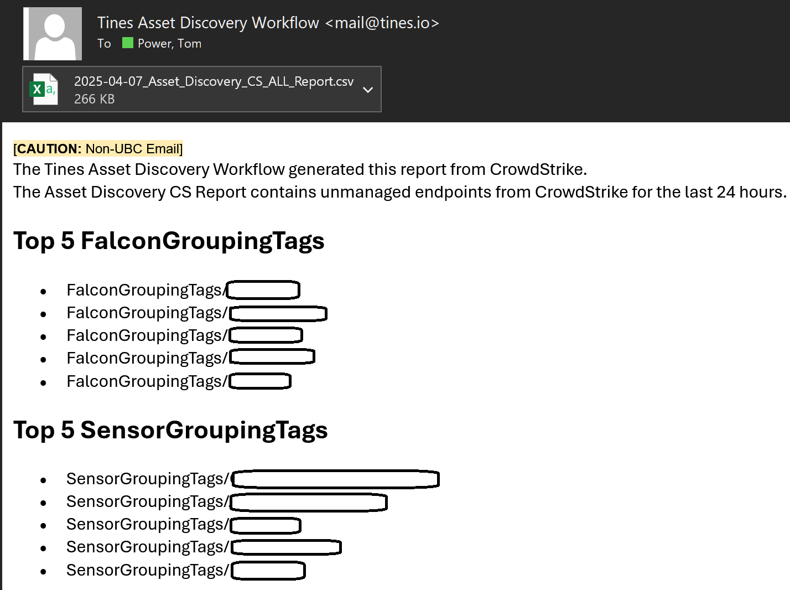
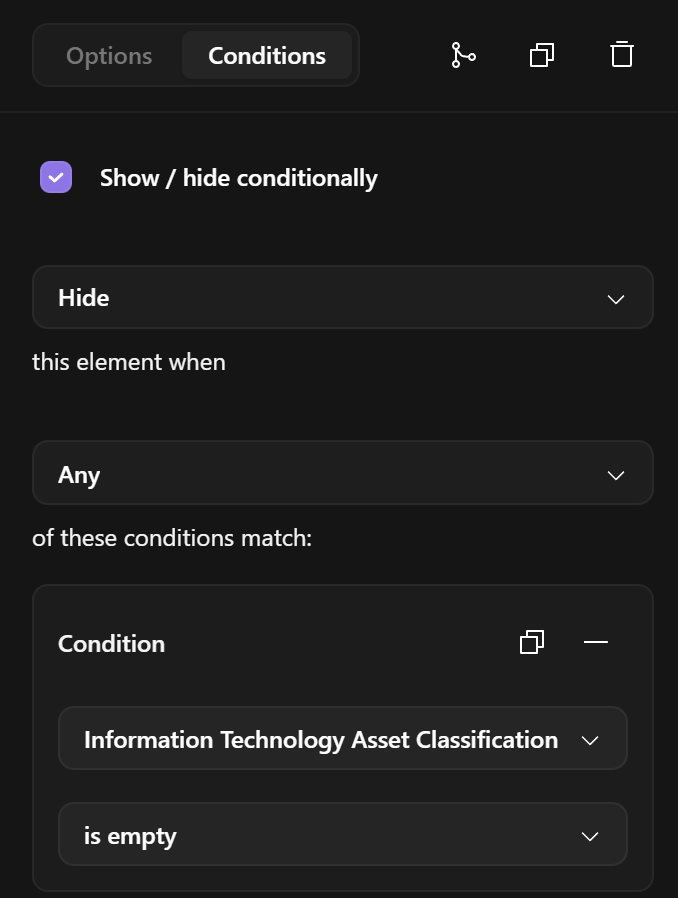

# Automating Asset Discovery with Tines
NIST updated the Cybersecurity Framework (CSF).  

They introduced the Govern function as the glue to the other functions of risk management:

- Identify,
- Protect,
- Detect,
- Respond,
- and Recover.

Governance creates a framework taliored to support the organization's critical mission. To ensure daily operations in the event of a cyber incident, business continuity plans, infosec policies and standards are created for resiliency.

### Identify - The CrowdStrike Asset Discovery API Endpoint
If an organization cannot identify an asset, it cannot protect it, even if there is governance.  

To assist with identifying assets in their environment, CrowdStrike created the Asset Discovery API endpoint.

This API endpoint discovers "unmanaged" endpoints.

Once the Falcon Sensor is installed on an endpoint, it discovers its neighbors via a passive method.  The Falcon Sensor determines which endpoints on the network are not present in the Falcon console. 

Those devices are considered "unmanaged" neighbors, since they are not managed by the Falcon platform.

We created a scheduled workflow where Tines queries the Asset Discovery API for unmanaged neighbors discovered in the last 24 hours.  

The Tines workflow generates a csv with the a list of unmanaged neighbors and information regarding the neighbor who discovered the unmanaged entity.

At the end of the workflow, we used a AI Automatic Event Transformation to create an HTML summary in the email to identify the top five departments with unmanaged endpoints:

To assit IT departments with identifying endpoints with no Endpoint Detection & Response (EDR), my teammate and I created a Tines webform.  An IT admin or infosec analyst, who does not have access to the CrowdStrike console, can upload a csv with hostnames to check to see if the host is present in the CrowdStrike Falcon platform and tagged properly.

CrowdStrike hosts, that are tagged with the departmental ID, are incorporated into CrowdStrike Fusion Workflows for email alert notifications. In addition, the same tags are used in CrowdStrike Schedule Reports for vulnerability reporting. 

The Tines workflows are straightforward using the Tines CrowdStrike templates for the Get host IDs, Get Host details, and Tag Host in CrowdStrike, which are available in the Tines product templates.

### AI Automatic Mode to Strip the FQDN of the hostname

The hostnames are parsed from the csv. Each hostname is exploded as an individual event.  Since the CrowdStrike /devices/queries/devices/v1 API endpoint for host management has a quirk in regards to fully qualified domain names (FQDN), we used the Tines AI Automatic mode in Event Transformation action to extract the hostname from the FQDN.

If an analyst submits a host with a FQDN, and the host is registered without a FQDN, the CrowdStrike Host API will not find the host.  The API will return a FQDN if querying the API by the hostname.

For example, host1.mydomain.com is registered in the console.  The Falcon API will return it if the hostname is submitted as host1 or host1.mydomain.com, but if host1.mydomain.com is submitted and host1 is registered in the console, the Falcon Host API will not find it.

### Conditional Tines Page Feature

Tines introduced a new feature for their Pages.  The page builder can hide or show page elements based on certain conditions or choices made in the webform.

We used this new feature in our CrowdStrike tagging webform to hide CrowdStrike tags that a department may not use.

In short, assest discovery and EDR compliance are challenging. 

With the Tines Pages and their automation platform, you can save time and resources by providing a webform for IT departments to check if the CrowdStrike Falcon Sensor is registred to the console and to discover "unmanaged" entities that do have EDR installed on it.

I hope you found this useful.  

You can import this Tines story into your tenant by downloading the json file in the [TinesStory](https://github.com/AutomateSecOps/EDgaR-Utility/tree/main/TinesStory) folder

Once you start automating, you cannot stop!

Happy Building.

Tom

## Tines Documenation
- [Tines AI Automatic Mode Event Transformation](https://www.tines.com/docs/actions/types/event-transformation/automatic//)
- [Tines IS PRESENT Function](https://www.tines.com/docs/formulas/functions/is-present/)
- [Tines Object Function](https://www.tines.com/docs/formulas/functions/object/)
- [Tines Append Element to Resource](https://www.tines.com/api/resources/append-element/)
- [Tines Pages](https://www.tines.com/docs/pages/)
- [Tines Pages Conditional Elements](https://www.tines.com/docs/pages/conditional-page-elements/)
- [Tines Community Edition](https://www.tines.com/pricing/)

## NIST
- [CSF](https://www.nist.gov/cyberframework)

[Previous Blog](https://umbrella.automatesecops.com/)
